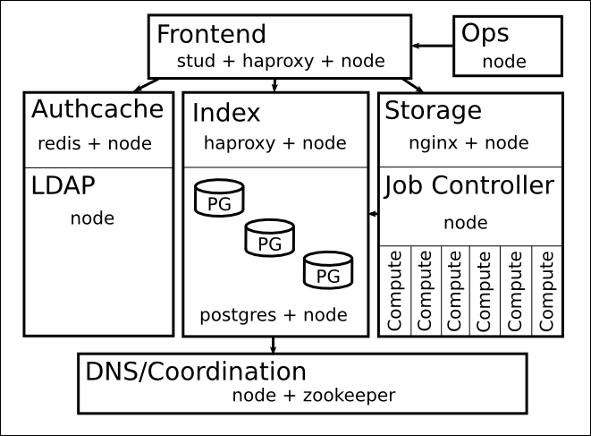
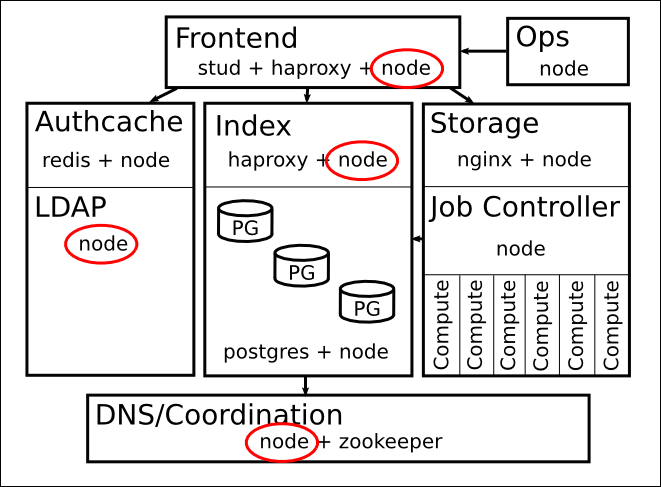
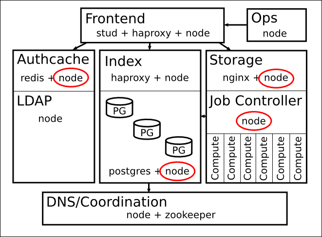
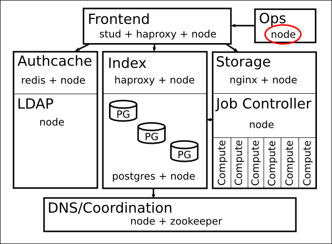
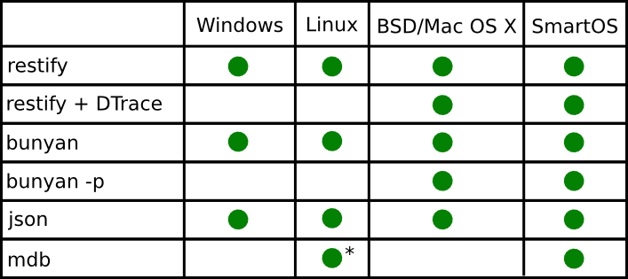

## Manta <3 node.js
### Nate Fitch

---
## Intro

1. Software Engineer at Joyent
1. Came to Joyent to work on Manta
    1. manta-compute-bin
    1. Object Garbage Collection
    1. Object Audit
    1. Manta Deployment

---
## Manta Architecture (High Level)

---
## Where we use Node: Servers

---
## Where we use Node: Controllers

---
## Where we use Node: Data Processing

---
## Where else we use Node:

1. CLIs
1. Service Deployment
1. One-off Manta jobs

---
## Some Focus: Servers

1. restify
1. bunyan
1. json
1. mdb

---
## restify

- Node framework for building RESTful APIs
    - Focus on observability and control
    - Automatic DTrace support for all handlers
- https://github.com/mcavage/node-restify
- https://www.npmjs.org/package/restify

---
## bunyan
- One-stop shop for emitting and processing JSON logs
    - Logger in node.js application
    - Tool for processing bunyan logs
    - Realtime log levels and filtering with `-p`
- https://github.com/trentm/node-bunyan
- https://www.npmjs.org/package/bunyan

---
## json
- Tool for all your json needs
    - `json -a remoteAddress`
    - `json -aC 'this._audit === true'`
    - `json -aE 'this.foo = "bar"'`
- https://github.com/trentm/json
- https://www.npmjs.org/package/jsontool

---
## MDB (Modular Debugger)
- `--abort-on-uncaught-exception`
- Take cores from running processes
- Common commands:
    - `::jsstack`
    - `::jsframe`
    - `::jsprint`
    - `::findjsobjects` (`-p` and `-r`)
- thoth

---
## Demo

---
## Compatability Matrix

---
## Engaging with node-core
- Use Gihub issues http://github.com/joyent/node
- Provide a clear description
- Provide a repro *in node*
- Examples:
    - https://github.com/joyent/node/issues/4692
    - https://github.com/joyent/node/issues/6297

---
## Helpful Blogs/Tutorials

- http://www.joyent.com/developers/node/debug
- http://www.joyent.com/blog/mdb-and-node-js
- http://www.joyent.com/developers/node/debug/mdb
- http://www.joyent.com/blog/mdb-and-linux
- http://blog.nodejs.org/2012/03/28/service-logging-in-json-with-bunyan/
- http://mcavage.me/blog/2013/07/19/using-node-modules-in-manta/

---
## Go here
- http://github.com/nfitch/node-demo
- @tumederanges
